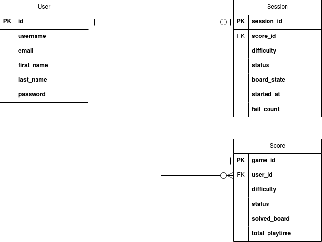

# BACKEND DESCRIPTION

This page contains a description of the backend.

## Backend Architecture and API Specification

### Database Schema

The backend application has three database tables:
+ User (*already described in the Authentication chapter*)
+ Score
+ Session

#### Score
The database table stores the scores of all games played by registered users. 

| Field Name    | Data Type | Description | Constraints | Default Value |
|---------------|-----------|-------------|-------------|---------------|
| game_id       | INTEGER | Autoincrementing primary key. | PRIMARY KEY | Autogenerated |
| user_id       | INTEGER | Foreign key linking to the User model. | FOREIGN KEY | None |
| status        | TEXT(20) | Represents the current status of the game. | 'in_progress' or 'completed' | 'in_progress' |
| solved_board_hash  | VARCHAR(64) | Hash of solved board. |  | "" |
| total_playtime| INTEGER | Total playtime in seconds. |  | 0 |

Each generated board must be unique for a particular user. To optimize querying, the solved board is not stored in its raw format; instead, only its hash is stored.

#### Session
The database table stores information about all active sessions of registered users.

| Field Name    | Data Type | Description | Constraints | Default Value |
|---------------|-----------|-------------|-------------|---------------|
| session_id    | INTEGER | Autoincremented primary key. | PRIMARY KEY | Autogenerated  |
| score_id      | INTEGER | Foreign key linking to the score model. | FOREIGN KEY | None |
| status        | TEXT(20) | Represents the current status of the session. | 'in_progress' or 'paused' | 'in_progress' |
| board_state   | JSONField | 9x9 matrix of integers in range 0 to 9 that represent state of the board when session was paused or created. |  |  |
| solved_board   | JSONField | 9x9 matrix of integers in range 0 to 9 that represent solved board. |  |  |
| started_at    | TEXT | Stores timestamp when state has been changed to 'in_progress' |  |  |
| fail_count    | INTEGER | Counter of failed moves. |  | 0 |

### API endpoints

#### /api/game/start

##### POST
Sending POST request:
+ checks whether authenticated user (bearer token) has already an active session (game). If yes, request is declined. Otherwise procedure continues.
+ generates new unique board for that particular user. Creates new score table entry and session table entry for that particular game.
+ return response 201.

If user does not authenticate itself, a new game is generated and response 201 is returned to the caller. It is not assured that every returned game is unique for the particular user/caller of the API.

**Request body:**
|Field|Type|Required|Description|
|--|--|--|--|
|difficulty|string|Yes|The difficulty level of the game. Options "easy", "medium", "hard", "expert".|

**Responses**

**201: Created** 
|Field|Type|Description|
|--|--|--|
|board_init_state|array|9x9 matrix of intigers in range 0 to 9. It contains initial board state.|
|board_solution|array|9x9 matrix of intigers in range 0 to 9. It contains solution for the game.|
|fail_count|integer|State of the counter of failed moves. By default counter is 0.|
|total_playtime|integer|Initial state playtime timer. By default counter is 0.|

**400: Bad Request** 
In case of invalid input.
|Field|Type|Description|
|--|--|--|
|error|string|Invalid difficulty level. Chose from "easy", "medium", "hard", "expert".|

**409: Conflict** 
|Field|Type|Description|
|--|--|--|
|error|string|User already has non-completed game.|

##### GET
API endpoint checks for authenticated user (bearer token) whether active game session exists.

Meethod is not supported for non-authenticated users.

**Request body:**
Empty

**Responses**

**200: OK** 
Same as 201 response of POST request.

**400: Bad Request** 
Same as 400 response of POST request.

**401: Unauthorized** 
|Field|Type|Description|
|--|--|--|
|error|string|GET method not available for non-authenticated users.|

**404: Not Found** 
In case that user does not have not-completed game.
|Field|Type|Description|
|--|--|--|
|error|string|No active game session found for the user.|

#### /api/game/pause

##### POST
If authenticated user (bearer token) has an active game session in state in_progress, the game session state will change to paused.
If user does not have active game session or it is already paused, server will return response 409.

**Request body:**
|Field|Type|Description|
|--|--|--|
|board_state| array| 9x9 matrix of intigers in range 0 to 9. It contains board state.|
|fail_count| integer| State of the counter of failed moves.|

**Responses**

**200: OK** 
Empty response.

**409: Conflict** 

Response 1:
|Field|Type|Description|
|--|--|--|
|error|string|User does not have active game session.|

Response 2:
|Field|Type|Description|
|--|--|--|
|error|string|Game session already paused.|

**401: Unauthorized** 
|Field|Type|Description|
|--|--|--|
|error|string|GET method not available for non-authenticated users.|

#### /api/game/resume

##### POST
If authenticated user (bearer token) has an active game session in state paused, the game session state will change to in_progress.
If user does not have active game session or it is already in state in_progress, server will return response 409.

**Request body:**
Empty

**Responses**

**200: OK** 
Empty response.

**409: Conflict** 

Response 1:
|Field|Type|Description|
|--|--|--|
|error|string|User does not have active game session.|

Response 2:
|Field|Type|Description|
|--|--|--|
|error|string|Game session already in_progress.|

**401: Unauthorized** 
|Field|Type|Description|
|--|--|--|
|error|string|POST method not available for non-authenticated users.|

#### /api/game/complete

##### POST
If authenticated user (bearer token) has an active game session in state paused, the score will change to completed and game session will be deleted.
If user does not have active game session, server will return response 409.

**Request body:**
|Field|Type|Description|
|--|--|--|
|board_state| array| 9x9 matrix of intigers in range 0 to 9. It contains board state.|
|fail_count| integer| State of the counter of failed moves.|

**Responses**

**200: OK** 
Empty response.

**409: Conflict** 

Response 1:
|Field|Type|Description|
|--|--|--|
|error|string|User does not have active game session.|

**401: Unauthorized** 
|Field|Type|Description|
|--|--|--|
|error|string|POST method not available for non-authenticated users.|